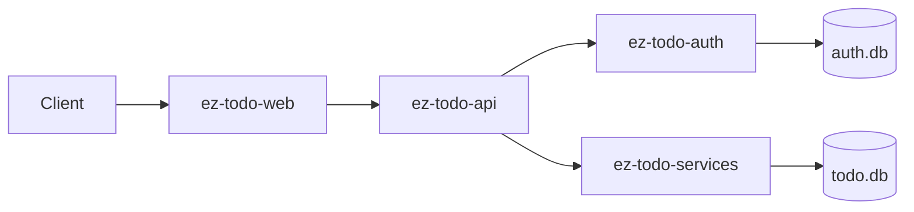
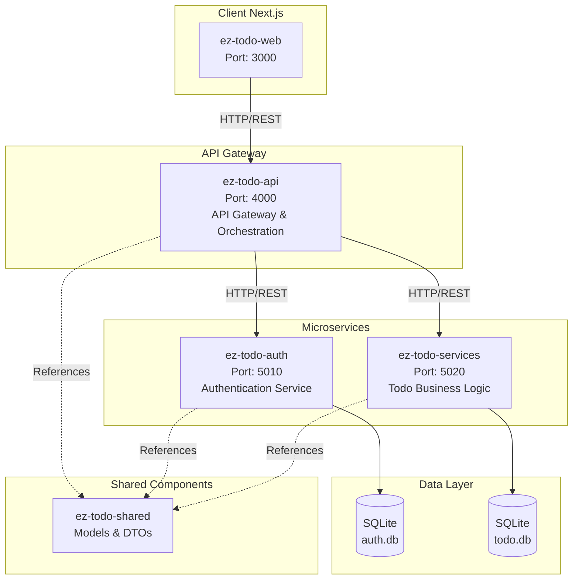

<p align="center"></p>

# EzTodo - The Todo Application

A simple todo application built with a microservices architecture using .NET 9, Next.js, and Docker. This project demonstrates clean architecture principles, JWT authentication, and service-oriented design.

## 🏗️ Architecture Overview

EzTodo follows a microservices architecture pattern with clear separation of concerns:

- **ez-todo-api**: API Gateway and orchestration layer
- **ez-todo-auth**: Authentication and user management service
- **ez-todo-services**: Core todo business logic service
- **ez-todo-web**: Next.js frontend application
- **ez-todo-shared**: Shared models and DTOs library

### System Architecture Diagram



### Detailed Service Architecture



## 🚀 Services Overview

### 1. ez-todo-api (API Gateway)
**Port**: 4000  
**Role**: Central entry point, request routing, and JWT validation

**Key Features**:
- JWT Bearer token authentication
- HTTP client orchestration to microservices
- CORS configuration for web client
- Swagger/OpenAPI documentation
- Health check endpoints

**Dependencies**:
- ez-todo-auth (for user authentication)
- ez-todo-services (for todo operations)

### 2. ez-todo-auth (Authentication Service)
**Port**: 5010  
**Role**: User management and JWT token generation

**Key Features**:
- User registration and login
- Password hashing with SHA256 + salt
- JWT token generation and validation
- SQLite database for user storage
- Default admin user creation


### 3. ez-todo-services (Todo Service)
**Port**: 5020  
**Role**: Core todo business logic and data management

**Key Features**:
- CRUD operations for todos
- Todo completion toggle
- SQLite database for todo storage
- Input validation and error handling


### 4. ez-todo-web (Frontend)
**Port**: 3000  
**Role**: User interface and client-side application (mixing SSR and CSR)

**Key Features**:
- Next.js 15 with App Router
- React Query for state management
- Tailwind CSS for styling
- TypeScript for type safety
- Server-side rendering
- Client-side rendering 

## 🔧 Technology Stack

### Backend
- **.NET 9**: Latest .NET Web API
- **SQLite**: Lightweight database
- **Docker**: Containerization

### Frontend
- **Next.js 15**: React framework with App Router
- **React 19**: Latest React version
- **TypeScript**: Type-safe JavaScript
- **Tailwind CSS**: Utility-first CSS framework
- **TanStack Query**: Data fetching and caching

### DevOps
- **Docker Compose**: Multi-container orchestration
- **OpenAPI/Swagger**: API documentation


## 🚀 Getting Started

### Prerequisites
- Docker and Docker Compose
- .NET 9 SDK (for local development)
- Node.js 18+ (for frontend development)

### Quick Start with Docker

1. **Clone the repository**:
   ```bash
   git clone <repository-url>
   cd ez-todo
   ```

2. **Start all services**:
   ```bash
   docker compose up --build
   ```

3. **Access the application**:
   - Web App: http://localhost:3000
   - API Gateway: http://localhost:4000
   - Auth Service: http://localhost:5010
   - Todo Service: http://localhost:5020

### Local Development

1. **Start the backend services**:
   ```bash
   # Terminal 1 - Auth Service
   cd ez-todo-auth
   dotnet build && dotnet run

   # Terminal 2 - Todo Service
   cd ez-todo-services
   dotnet build && dotnet run

   # Terminal 3 - API Gateway
   cd ez-todo-api
   dotnet build && dotnet run
   ```

2. **Start the frontend**:
   ```bash
   cd ez-todo-web
   npm install
   npm run dev
   ```

## 🔐 Authentication

The application uses JWT (JSON Web Tokens) for authentication:

1. **User Registration**: `POST /api/user/signup`
2. **User Login**: `POST /api/user/login`
3. **Protected Routes**: Include `Authorization: Bearer <token>` header

### Default Admin User
- **Email**: admin@eztodo.com
- **Password**: userAdminPassword

## 📊 API Endpoints

### Authentication Endpoints
- `POST /api/user/signup` - User registration
- `POST /api/user/login` - User login

### Todo Endpoints (Protected)
- `GET /api/todo` - List all todos
- `GET /api/todo/{id}` - Get todo by ID
- `POST /api/todo` - Create new todo
- `PUT /api/todo/{id}` - Update todo
- `DELETE /api/todo/{id}` - Delete todo
- `PATCH /api/todo/{id}/toggle` - Toggle completion status

### Health Check
- `GET /health` - Service health status

## 🧪 Testing

### API Testing
Use the provided HTTP files for testing:
- `ez-todo-api/todo-api.http`
- `ez-todo-auth/ez-todo-auth.http`
- `ez-todo-services/ez-todo-services.http`

### Health Checks
All services provide health check endpoints:
- http://localhost:4000/health (API Gateway)
- http://localhost:5010/health (Auth Service)
- http://localhost:5020/health (Todo Service)

## 🚀 Deployment

### Production Considerations
1. **Database**: Replace SQLite with PostgreSQL/MySQL
2. **Security**: Use proper JWT secrets and HTTPS
3. **Monitoring**: Add logging and metrics
4. **Load Balancing**: Use reverse proxy (nginx)
5. **Container Registry**: Push images to registry

## 📈 Future Enhancements

1. **Database Migration**: Add Entity Framework migrations
2. **Caching**: Implement Redis for session management
3. **Monitoring**: Integrate with Prometheus/Grafana
4. **CI/CD**: GitHub Actions for automated deployment
5. **Testing**: Add unit and integration tests

---

<<<<<<< HEAD
# EZ TODO APP

Details coming soon
=======
>>>>>>> 2d05f89 (add architecture and implementation  details in readme)
